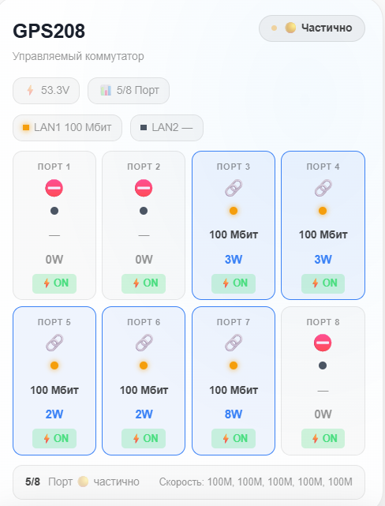
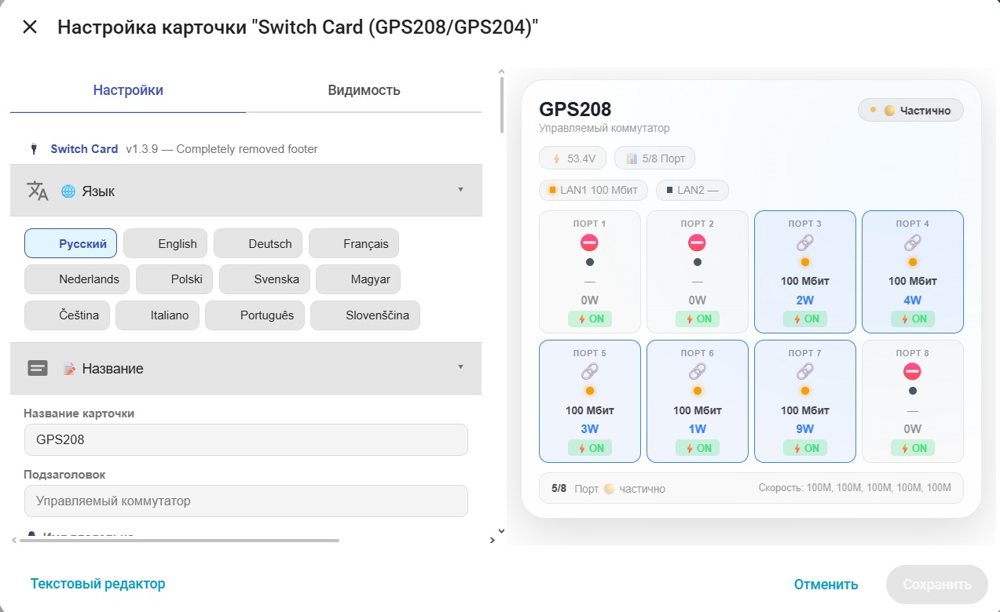

# HA Switch Card

[](https://github.com/hacs/integration)


Пользовательская карточка для Home Assistant Lovelace, предназначенная для мониторинга и управления управляемыми коммутаторами GPS208 и GPS204. Поддерживает отображение состояния портов, скорости соединения, потребляемой мощности, управления PoE, а также полностью настраиваемый интерфейс.

**Не требует дополнительных плагинов. Работает автономно, полностью настраивается через встроенный редактор UI.**

---

## 📸 Превью

<div style="display: flex; gap: 10px; flex-wrap: wrap;">
  
  
</div>

---

## 🎛️ Визуальный редактор



---

## ✨ Возможности

### 🎨 Отображение и интерфейс
- 🔌 **Основной экран** — название устройства, подзаголовок, персонализированное приветствие
- 📊 **Сетка портов** — отображение до 8 портов с индикацией статуса
- 🟢 **Статус соединения** — цветовая индикация скорости каждого порта
- ⚡ **Потребляемая мощность** — отображение мощности на каждом порту
- 🌡️ **Дополнительные датчики** — напряжение, температура, uptime, статус LAN портов
- 🔄 **Автоматическое обновление** — данные обновляются каждые 30 секунд

### 🏠 Режимы работы
- **📦 Две модели** — GPS208 (8 портов) и GPS204 (4 порта)
- **🌙 Три темы оформления** — Auto (автоматическая), Light (светлая), Dark (тёмная)

### ⚡ Управление PoE
- **🔘 Включение/выключение PoE** — клик по индикатору PoE на порту
- **⚡ Визуальная обратная связь** — анимация при переключении
- **🔄 Автоматическое обновление** — состояние обновляется после выполнения команды

### 🎨 Визуальная настройка
- **6 готовых градиентов фона** — Default, Night, Ocean, Deep Neon, Slate, Tech, Custom
- **6 цветовых настроек** — Online, Offline, Partial, Port Active, Accent, Text
- **Настройка прозрачности фона** — от 0% до 100%
- **Настройка размытия фона** — от 0px до 30px

### 🖱️ Взаимодействие
- **📊 Клик по порту** — открывает более подробную информацию (more-info)
- **⚡ Клик по мощности** — открывает историю потребления энергии
- **🔘 Клик по PoE** — переключает питание порта (вкл/выкл)
- **🌐 Клик по LAN** — открывает информацию о сетевом соединении

### 🌐 Поддержка языков (12 языков)
- 🇬🇧 English / 🇨🇿 Čeština / 🇩🇪 Deutsch / 🇫🇷 Français
- 🇮🇹 Italiano / 🇭🇺 Magyar / 🇳🇱 Nederlands / 🇵🇱 Polski
- 🇵🇹 Português / 🇷🇺 Русский / 🇸🇮 Slovenščina / 🇸🇪 Svenska

### 🔄 Дополнительные функции
- **📱 Адаптивная верстка** — корректное отображение на мобильных устройствах
- **📊 Статус-бар** — отображение количества активных портов и скоростей
- **🎯 Индикация статуса** — общий статус устройства (онлайн/частично/оффлайн)
- **🔌 LAN-порты** — отдельное отображение LAN1 и LAN2 с мощностью и PoE

---

## 📦 Установка

### Способ 1 — HACS (рекомендуется)

**Шаг 1:** Добавьте пользовательский репозиторий в HACS:

[](https://my.home-assistant.io/redirect/hacs_repository/?owner=ananyevgv&repository=ha-switch-card&category=plugin)

> Если кнопка не работает, добавьте вручную:
> **HACS → Панель → ⋮ → Пользовательские репозитории**
> → URL: `https://github.com/ananyevgv/ha-switch-card` → Тип: **Панель** → Добавить

**Шаг 2:** Найдите **HA Switch Card** → **Установить**

**Шаг 3:** Жёстко обновите браузер (`Ctrl+Shift+R`)

---

### Способ 2 — Ручная установка

1. Скачайте [`ha-switch-card.js`](https://github.com/ananyevgv/ha-switch-card/releases/latest)
2. Скопируйте разархивированные файлы архива в `/config/www/ha-switch-card`
3. Перейдите в **Настройки → Панели → Ресурсы** → **Добавить ресурс**:

| Параметр | Значение |
|----------|----------|
| URL | `/local/ha-switch-card.js` |
| Тип ресурса | `JavaScript Module` |

---

## 🚀 Примеры использования

### Полная конфигурация (GPS208)
```yaml
type: custom:switch-card
model: gps208
title: Сетевой коммутатор
subtitle: Управляемый PoE свитч
owner_name: Smart Home
language: ru
theme: auto
voltage_entity: sensor.gps208_voltage
uptime_entity: sensor.gps208_uptime
temperature_entity: sensor.gps208_temperature
lan1_link_entity: sensor.gps208_lan1_link
lan1_power_entity: sensor.gps208_lan1_power
lan1_poe_entity: switch.gps208_lan1_poe
lan2_link_entity: sensor.gps208_lan2_link
lan2_power_entity: sensor.gps208_lan2_power
lan2_poe_entity: switch.gps208_lan2_poe
port1_link_entity: sensor.gps208_1_link
port1_power_entity: sensor.gps208_1_power
port1_poe_entity: switch.gps208_1_poe
# ... и так далее для всех портов до 8
